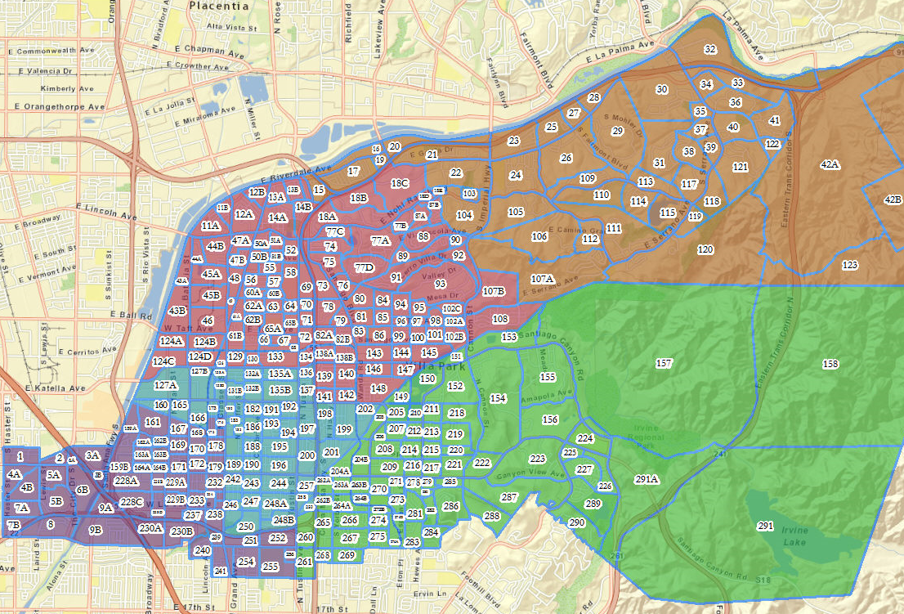

# What Are Study Areas?
Study Areas are the building blocks of a school district. Study Areas are geographically defined, following logical boundaries of a neighborhood and are used for gathering data. SchoolSite Pro does not use separate datasets for each set of school attendance areas. Using a unique field coding method, all attendance areas are stored within the Study Area dataset. By using these building blocks or Study Areas, various groupings of these areas can be used to simulate attendance area changes and can be useful for deciding where to open or close schools.

 

Districts with established study areas will need to make sure the study areas are in an Esri supported format– geodatabase, shapefile, or coverage. If your district does not have existing study areas, you will need to divide your district into study areas based on one or more of the criteria described below. See the topic "How to Create Your Own Data" for more information about creating the attribute table for a study area dataset.

**Study Area Boundary Line Criteria:**
1. Current school attendance areas

1. All major streets (existing or future)

1. All railroads

1. All drainage channels or waterways

1. Lines between developed and undeveloped portions of the district

1. Lines between different types of zoning

1. Unusual terrain features and impediments to pedestrian traffic

1. City limit lines

1. Different types of housing such as old versus new, apartment versus single family

1. Census geography

 

Study areas should be small enough to allow flexibility in modifying boundaries. Davis Demographics suggests no more than 50-75 students per study area. Although the number of study areas per district varies, the general rule of thumb is, more study areas equals more flexibility. Urban districts will require more study areas due to population density.  The opposite is the case for rural areas.  Study area boundaries in established neighborhoods, however, should never change once established. Study areas in undeveloped portions of the district can be split as development occurs and road circulation patterns become evident. Any changes to study areas that you make should be accomplished prior to students moving into the area.

 

In the example below, the study areas are shown in blue outlines with unique numbers assigned to each:

