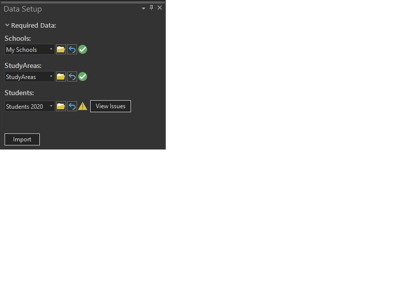
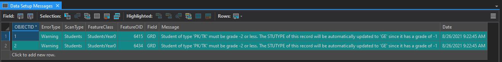
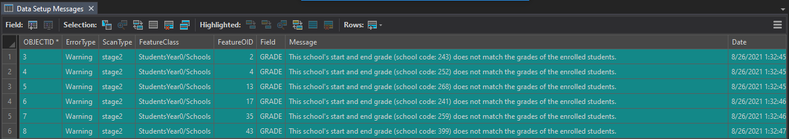
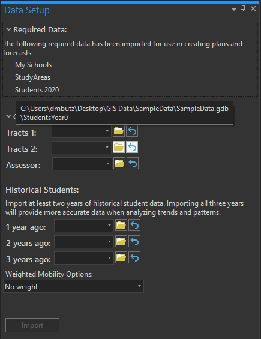

# Using Data Setup
## SchoolSite Pro Data Setup for Redistricting Plans & Forecasts
The SchoolSite Pro Data Setup imports and checks your GIS data for compatibility with SchoolSite extensions. In each Pro project, you will be importing one set (or copy) of data that will be used as the basis for all plans and forecasts created in that Pro project. If you need to use different source data such as a different student file or different studyarea data, you will want to create a new Pro project based around that set of data.

You can access Data Setup through the SchoolSite ribbon.

  

There are three datasets required to create plans and forecasts. Visit the links below to learn more about the requirements for each dataset:
1.	[Schools](../createData/createSchools.md)
2.	[Study Areas](../createData/createStudyareas.md) 
3.	[Students](../createData/createStudents.md)

## First Round of Data Valiation
In the first round of data validation, the software will check each individual featureclass to make sure it has the required fields and that they are populated correctly.

1. In the Data Setup pane, select the  schools, study areas and students’ files you want to import/validate and it will automatically run once you've selected your file.
2. You can either add each layer to your map and then select it from the dropdown menu, or you can browse to the data's location on your computer and it will be added to your current map as a new layer and then scanned.
3. Wait a few seconds until the green progress bar completes. When the check for the file is finished, you will see one of three icons:

<table>
  <tr>
    <td>  </td>
    <td> Valid dataset. The feature class meets all the requirements and additional suggestions for SchoolSite Redistricting </td>
  </tr>
  <tr>
    <td>  </td>
    <td> Warning. The feature class meets all the requirements for SchoolSite Redistricting but there is room for some potential improvments </td>
  </tr>
  <tr>
    <td>  </td>
    <td> Not Valid. The feature class is missing one or more requirements for SchoolSite Redistricting </td>
  </tr>
</table>
  
After each layer is scanned, if there is anything to report about your data then a table will appear with a log of all the warnings or errors found. 
  
If your data is valid, a green check mark will appear next to it.

If your data has warnings that you should be aware of, an exclaimation point will appear next to it. These warnings indicate areas of improvment or highlight aspects of your data that seem incorrect on the surface. For example, if you have the Capacity field on the school data but it is empty it will show a wanring to alert you that if you fill in school capacity values then you will be able to make more useful reports.

If your data has errors, a red "Not Valid" icon appears and you must fix the errors and rescan the data until you get a green check mark or at least a warning icon before importing it to create a plan or forecast.

In the example below, the Student data resulted in a warning sign. 

To learn more about the errors, you can refer to the Data Setup Messages table. You can choose to ignore the warning and proceed to import the data anyways into your SchoolSite geodatabse and use it for making plans or forecasts.

## Second Round of Data Valiation
In the second round of data validation, the software will check all three feature classes and how they relate to each other. For example, schools that are coded to studyareas must actually exist in the Schools featureclass. Otherwise, this will report as an error. Another example is making sure that the school's each student are enrolled also exist in the Schools featureclass. If there are any warnings or errors found at this time, they will be reported in the Data Setup Messages table just like before. Here is an example of some inconsistencies between the Student data and the School data.

If you have warnings, you can choose to continue anyways and import the data or you can stop at this point to review the warnings and make any corrections. Once you choose to continue, these three featureclasses wil be copied from their current location into the SchoolSite file geodatabase that is stored in the ArcGIS Pro project's default directory. If you hover your mouse over the name of the imported featureclasses, a tooltip will appear showing the original path of that data for reference.

For more information about the data requirements for creating Redistricting Plans and Forecasts, view the following topics:
* [Data Checks Made for Redistricting Plans](checkRedistrict.md)
* [Data Checks Made for Forecasts](checkForecasts.md)

If you have need further assistance, the list of warning and errors in the Data Setup Messages table can be emailed to Davis Demographics' Tech Support by exporting table results and emailing them to techsupport@davisdemographics.com.
