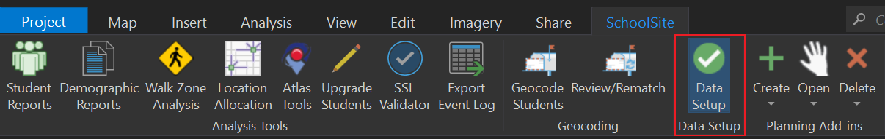

# Using Data Setup
## SchoolSite Pro Data Setup for SchoolSite Redistricting Plans, SchoolSite Forecasts, and SchoolSite Locator
The SchoolSite Pro Data Setup imports and checks your GIS data for compatibility with SchoolSite extensions. In each Pro project, you will be importing one set of data that will be used as the basis for all plans and forecasts created in that Pro project. If you need to use different source data such as a different student file or different studyarea data, you will want to create a new Pro project based around that set of data.

You can access Data Setup through the SchoolSite ribbon.

  

There are three required datasets for use in creating plans and forecasts:
1.	[Schools](../dataManagement/createData/createSchools.md)
2.	[Study Areas](../dataManagement/createData/createStudyareas.md) 
3.	[Students](../dataManagement/createData/createStudents.md)

  

1. In the Data Setup pane, select the  schools, study areas and students’ files you want to import/validate and it will automatically run once you've selected your file.
2. You can either add each layer to your map and then select it from the dropdown menu, or you can browse to the data's location on your computer and it will be added to your current map as a new layer and then scanned.
3. Wait a few seconds until the green progress bar completes. When the check for the file is finished, you will see one of three icons:

<table>
  <tr>
    <td>  </td>
    <td> Valid dataset. The feature class meets all the requirements and additional suggestions for SchoolSite Redistricting </td>
  </tr>
  <tr>
    <td>  </td>
    <td> Warning. The feature class meets all the requirements for SchoolSite Redistricting but there is room for some potential improvments </td>
  </tr>
  <tr>
    <td>  </td>
    <td> Not Valid. The feature class is missing one or more requirements for SchoolSite Redistricting </td>
  </tr>
</table>
  
After each layer is scanned, if there is anything to report about your data then a table will appear with a log of all the warning or errors found. 
  
If your data is valid, a green check mark will appear next to it.

If you choose data that is missing an optional field or has data that not be complete, you will see a warning in the Data Setup table. In the example below, the Schools data resulted in a warning sign. To find out what happened, read the CustomMessage column. You will be able to create a plan without fixing the warning. 

If a red, "Not Valid" icon appears, you must fix the error and run it through the Data Validator again before using it to create a plan, forecast or locator.

If you have need further assistance, the log files can be emailed to Davis Demographics' Tech Support by exporting your results and emailing them to techsupport@davisdemographics.com.

For more information about the data requirements for Redistricting Plans, Forecasts, and Locators, view the following topics:

* [Data Checks Made for Redistricting Plans](checkRedistrict.md)

* [Data Checks Made for Forecasts](checkForecasts.md)

* [Data Checks Made for Locator](checkLocator.md)
 
 
