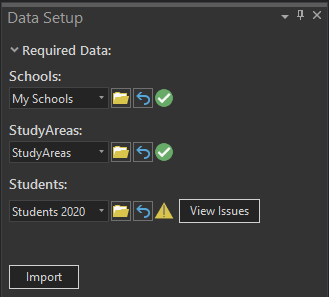

# Using Data Setup
## SchoolSite Pro Data Setup for SchoolSite Redistricting Plans, SchoolSite Forecasts, and SchoolSite Locator
The SchoolSite Pro Data Setup imports and checks your GIS data for compatibility with SchoolSite extensions. In each Pro project, you will be importing one set of data that will be used as the basis for all plans and forecasts created in that Pro project. If you need to use different source data such as a different student file or different studyarea data, you will want to create a new Pro project based around that set of data.

You can access Data Setup through the SchoolSite ribbon.

  

There are three required datasets for use in creating plans and forecasts:
1.	[Schools](../dataManagement/createData/createSchools.md)
2.	[Study Areas](../dataManagement/createData/createStudyareas.md) 
3.	[Students](../dataManagement/createData/createStudents.md)

  

1. In the Data Setup pane, select the  schools, study areas and students’ files you want to import/validate and it will automatically run once you've selected your file.
2. You can either add each layer to your map and then select it from the dropdown menu, or you can browse to the data's location on your computer and it will be added to your current map as a new layer and then scanned.
3. Wait a few seconds until the green progress bar completes. When the check for the file is finished, you will see one of three icons:

<table>
  <tr>
    <td>  </td>
    <td> Valid dataset. The feature class meets all the requirements and additional suggestions for SchoolSite Redistricting </td>
  </tr>
  <tr>
    <td>  </td>
    <td> Warning. The feature class meets all the requirements for SchoolSite Redistricting but there is room for some potential improvments </td>
  </tr>
  <tr>
    <td>  </td>
    <td> Not Valid. The feature class is missing one or more requirements for SchoolSite Redistricting </td>
  </tr>
</table>
  
After each layer is scanned, if there is anything to report about your data then a table will appear with a log of all the warnings or errors found. 
  
If your data is valid, a green check mark will appear next to it.

If your data has warnings that you should be aware of, an exclaimation point will appear next to it. These warnings indicate areas of improvment or highlight aspects of your data that seem incorrect on the surface. For example, if you have the Capacity field on the school data but it is empty it will show a wanring to alert you that if you fill in school capacity values then you will be able to make more useful reports.

If your data has errors, a red "Not Valid" icon appears and you must fix the errors and rescan the data until you get a green check mark before importing it to create a plan or forecast.

In the example below, the Student data resulted in a warning sign. To find out what the errors are you can refer to the Data Setup Messages table. You can choose to ignore warnnig and proceed to import the data anyways into your SchoolSite geodatabse and use it for making plans or forecasts.

If you have need further assistance, the log files can be emailed to Davis Demographics' Tech Support by exporting your results and emailing them to techsupport@davisdemographics.com.

For more information about the data requirements for Redistricting Plans, Forecasts, and Locators, view the following topics:

* [Data Checks Made for Redistricting Plans](checkRedistrict.md)

* [Data Checks Made for Forecasts](checkForecasts.md)

* [Data Checks Made for Locator](checkLocator.md)
 
 
