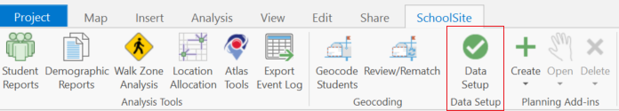

# Using Data Setup
## SchoolSite Pro Data Setup for SchoolSite Redistricting Plans, SchoolSite Forecasts, and SchoolSite Locator
The SchoolSite Pro Data Setup imports and checks your GIS data for compatibility with SchoolSite extensions. 

You can access Data Setup through the SchoolSite tab.

  

There are three required datasets for use in creating plans and forecasts:
1.	[Schools](dataManagement/createData.md/createSchools.md)
2.	[Study Areas](dataManagement/createData.md/createStudyareas.md) 
3.	[Students](dataManagement/createData.md/createStudents.md)

  

**Please Note: Data Setup works the same for each kind of validation (Redistricting Plans, Forecasts, and Locator).**
1. In the Data Setup pane, select the  schools, study areas and students’ files you want to import/validate and it will automatically run once you've selected your file.
2. Wait a few seconds until the green progress bar completes. When the check for the file is finished, you will see one of three icons:

  

If the data is all valid for use, you will see green check marks for each.
However, if you choose data that is missing an optional field, you will see a warning in the SchoolSiteEventLog table. In the example below, the Schools data resulted in a warning sign. To find out what happened, read the CustomMessage column. You will be able to create a plan without fixing the warning. However, if a red, "Not Valid" icon appears, you must fix the error and run it through the Data Validator again before using it to create a plan, forecast or locator.

If you have need further assistance, the log files can be emailed to Davis Demographics' Tech Support by exporting your results and emailing them to techsupport@davisdemographics.com.

For more information about the data requirements for Redistricting Plans, Forecasts, and Locators, view the following topics:

* [Data Checks Made for Redistricting Plans](checkRedistrict.md)

* [Data Checks Made for Projections](checkProjections.md)

* [Data Checks Made for Locator](checkLocator.md)
 
 
