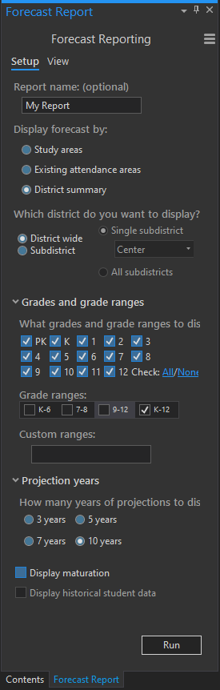
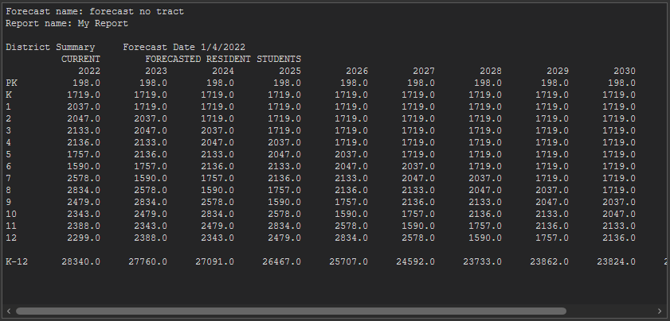
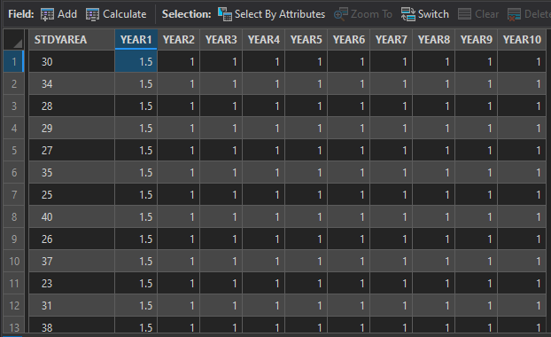
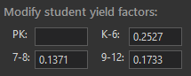

# A tour of the forecast ribbon
The following is a brief tour of the basics of Forecasts in SchoolSite Pro. You can install sample data from Davis Demographics in order to follow along.

## Forecast Reports
To view forecast reports, modify factors, refresh forecast, and export forecasts choose the green Forecasting ribbon.

### Begin by creating a district wide report:
Click on the Forecasting ribbon, then Forecast Reports. The Setup Tab should display by default. (If the View tab is displayed, click on the Setup tab.)

1. Under "Display forecast by:", choose the radio button labeled District summary.
2. Under "Which district do you want to display?", choose the radio button labeled District wide.
3. Under "Grade ranges:", choose K-12.
4. Under the question "How many years of projection to display?", click on the radio button 10 years.

When you finish with the above steps, your screen should look like the following example:

To see the report you have set up, click on the View tab. You may have to adjust the size of the window to see the last few years of the projection.

The district summary above shows the results of a straight pass-through projection for the base year 2022. Next, we will change the birth rate, mobility and residential housing trends and view the results.

### Modify Variables - Birth Rates/K Factors
Click Modify Factors in Forecasting ribbon and choose K Factors. Two dockpanes will display: a setup dockpane and a table dockpane.

In the setup dockpane under "Specify study areas to display", choose the radio button All study areas.

There are two ways to edit  your K Factors:

- Method 1: Edit by selecting entire column
 
In the table dockpane, right click on the YEAR1 column name and choose Calculate Field" to change the value of the first year of forecasts for all study areas district wide. You can also click on the Calculate button at the top of the table to select the field you would like to change. 

Type in the value 1.05 in the box next to "YEAR1:"

Click on the Apply button. The values for all study areas in the column will change as illustrated. This factor applies a multiplier of 1.05 (a 5% increase) to the Kindergarten class for the first year of projections for all study areas selected.

- Method 2: Edit by selecting individual cells

Double click on the cell you would like to change, and press enter. The Refresh Forecast will appear in the Forecasting ribbon to update the map.
 
To view the results of modifying your K Factors, click on the tabs Forecast Reports > View. After allowing the program to calculate the results you will notice the change in projections as the years progress.  Modifying the K Factors affects only the Kindergarten class, however those changes are propagated through the projection by the Kindergarten class matriculation.

You can reset your report to its default values by going back to Mody Factors > K factors > Set Up > Use default values

Next, we will see the results of modifying a mobility (or cohort) factor for the district.
 
### Modify Variables - Mobility Factors
Click Modify Factors in Forecasting ribbon and choose Mobility Factors

1. Under "Grades to display:", check grades 1-6.
2. Under "Specify study areas to display", choose All study areas.
3. Under "Calculate Mobility", type 1.1 in the box next to MF 1. Repeat this step for columns MF2, MF3, MF4, MF5, and MF6, all with the value 1.1.

Mobility rates affect each year of the projections. The mobility factors are multiplied by each grade which in turn produces the number of students for the next grade the following year. For example, if you have 100 1st grade students in 2010 and multiple that number by a 1.1 (10%) mobility rate, there will be 110 2nd grade students in 2017. In other words, each grade's incoming class is modified by the appropriate mobility factor regardless of the class size.

To view the results, click on the Report Tab and view the projection district wide again. Notice the change in projections again. Grades 7-12 will remain with the default 1.00 mobility rate.

**Please note:** We are applying this same cohort factor for every study area across the district. There are options to apply different cohorts/mobility factors to different study areas or attendance areas within the district.

### Modify Variables - Student Yield Factors and Development
Click Modify Factors in Forecasting ribbon and choose Student Yield Factors

1. Under "Specify types to display", check only the box next to Type 1. (Type 1 represents in this example Single Family Dwelling Units).
2. Under "Modify student yield factors:" type in the following values shown below.

In this example, we are assuming that 0.2527 K-6 students will be generated for every Type 1 Single Family Detached (SFD) Unit.  In addition, 0.1371 7-8 students and 0.1733 9-12 students will be generated from each new housing unit.
