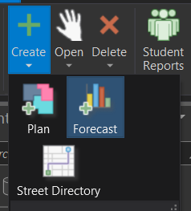

# Create a New Forecast

To create a new set of projections: SchoolSite > Create > Forecast

Type in the name of your forecast and select the student types you wish to incluse in the forecast (Resident , Special Education, Indepent Study, Charter, Other) 

Select the base forecast date

Enter Tract Data (Optional) If you imported tract data in Data Setup, you can choose to use tract data in your forecast. Once you click the check box next to "Use Tract Data", you will then select which tract data you'd like to use in your forcast. 
 
Enter Assessor Data (Optional)
This information is filled in Year 0 in the modify variables/projected housing units in the forecast properties dialog window.  This step is optional, as this data is only used if you intend to generate or develop maturation forecasts.  The housing types that you have specified in the assessor file (Type 1, 2, 3, and 4) should match the new housing types defined in the tract dataset.

Checkmark the box, next to "Use assessor data". The same housing types found in the tract dataset should also be in the assessor file (This may require you to add additional fields and pre-process your assessor attribute table).

Once all the fields are properly filled in, click on the Finish button to create the forecast.  The forecast will take a few minutes to create.

Please Note:  You can decrease the time needed to create forecasts by including only the necessary fields in the study area, student, school, tract and assessor datasets.  The time to create a forecast also depends on the number of students in the district.

Once the forecast has completed, it will be added to the table of contents as a map and displayed in light blue. To modify factors (i.e. birth factors, mobility factors, student yield factors etc), click on the Modify Factors in the Forecasting ribbon.
