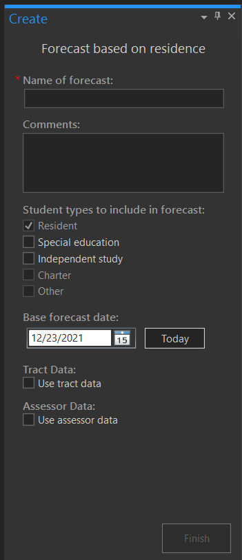

# Create a new forecast

To create a forecast, on the SchoolSite, click Create then Forecast.

Type in the name of your forecast and select the student types you wish to include in the forecast (Resident, Special Education, Indepent Study, Charter, Other).

Select the base forecast date

## Enter Tract Data (Optional)
Tract data describes the location and phasing for planned residential development within the District. Click [here](../dataManagement/createData/createTracts.md) for more information about tracts. 

Including tract data into your forecast adds housing development information to your forecast. It will allow you to generate a development summary report for your District, or a project summary report. In combination with student yield factors, it allows your forecast to consider new housing built in the future.

If you imported tract data in Data Setup, you can choose to use tract data in your forecast. Once you click the check box next to "Use Tract Data", you will then select which tract data you'd like to use in your forcast. 
 
## Enter Assessor Data (Optional)
Assessor data is a table of parcel information that was geocoded to a street network.  Click [here](../dataManagement/createData/createAssessor.md) for more information about tracts. 

Including assessor data into your forecast allows for maturation (build out) information to be added to your forecast. It can be used to determine student yield factors by housing type, and is also used in estimating the number of existing dwelling units for maturation projections. In combination with tract data, assessor data allows your forecast to consider new housing built in the future.

This information is filled in Year 0 in the modify variables/projected housing units in the forecast properties dialog window.  This step is optional, as this data is only used if you intend to generate or develop maturation forecasts.  The housing types that you have specified in the assessor file (Type 1, 2, 3, and 4) should match the new housing types defined in the tract dataset.

Checkmark the box, next to "Use assessor data". The same housing types found in the tract dataset should also be in the assessor file (This may require you to add additional fields and pre-process your assessor attribute table).

Once all the fields are properly filled in, click on the Finish button to create the forecast.  The forecast will take a few minutes to create.

Please Note:  You can decrease the time needed to create forecasts by including only the necessary fields in the study area, student, school, tract and assessor datasets.  The time to create a forecast also depends on the number of students in the District.

Once the forecast has completed, it will be added to the table of contents as a map and displayed in light blue. To modify factors (i.e. birth factors, mobility factors, student yield factors etc), click on the Modify Factors in the Forecasting ribbon.

# Copy a forecast
You can also create a new Forecast by copying an existing Forecast. This is useful if you want to make some initial basic changes to the Forecast that will apply to all others, and then create variations on top of those changes. 

Copying a Forecast is just like copying a map in ArcGIS Pro. From the Catalog pane, open the Maps section and find the map that contains your Forecast. 

If you are unsure which maps have a Forecast, click the Open button from the SchoolSite ribbon to get a specific list of SchoolSite Plans and Forecasts. 

Right-click the map that contains the Forecast that you would like to copy and choose Copy. Then, right-click on the Maps folder and click Paste'.

A copy of your Forecast will appear with the same name and the number '1' at the end.

At this time, you can now rename your Forecast by simply renaming the map as you would any other map in ArcGIS Pro. 

SchoolSite Pro will understand that this map contains a Forecast and will update tables accordingly to update the Forecast's name.
