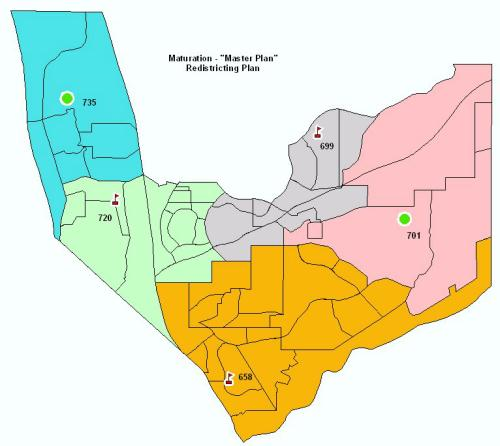
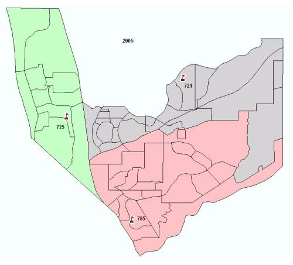

# Maturation concept

While seven to ten year forecasts are helpful for planning in the short term, maturation forecasts are better suited to long term forecasting and site selection. It is not good planning practice to base long term site selection and facility needs based upon short to mid-term forecasts. The decision a planner could make for locating a future school using a ten year forecast may not be the best decision as development continues to occur further into the future. For example, a future school site placed in or near a development occurring in the next few years may not be the best location for that school in relation to other potential school sites, as future development projects expand into other areas of the district. 

Maturation forecasts are essentially a housing saturation forecast from which SchoolSite Pro will estimate the total number of students within each study area that the district can expect when all available parcels have been developed under current zoning conditions (commonly referred to as "build out").

There is no specific time frame implied as to when maturation will occur. It cannot, and should not, be assumed that this is the "eleventh” year of a ten year forecast. Maturation forecasts are calculated completely separate from the ten year forecasts. As part of your District's master plan, maturation forecasts provide a long-term outlook of the student population and distribution when all housing is accounted for.   

In a typical Master Planning scenario, the planner would generate both a ten year forecast and a maturation forecast. Using the maturation student forecasts by study area, a redistricting plan (using SchoolSite Pro) would be created for each grade grouping within the district (K-6, 7-8, 9-12, etc.) to evaluate the location and facility needs of future school sites when all land is developed. In the K-6 elementary plan shown below, three schools currently exist and two additional sites have been determined to be necessary at build out. One is on the east side of the district and one is in the northwest area of the district. This is the Master Plan for elementary schools in this example District.  

After a Master Plan is created above, additional plans are created for each year of the forecast which help to determine which schools identified at maturation are required in any particular year.  In the example plan for 2008 below, the enrollment forecasts support only one of the two schools identified at build out (the northwest location).  

In the plan shown below for year 2005, none of the future schools identified at build out are required. The district should be able to accommodate future enrollment within the capacity of the existing three schools (although attendance boundary balancing of enrollment may be necessary with SchoolSite Pro).

In general, planning through the use of both maturation and short to mid-term forecasts, provide an orderly method to determine future school site needs and timing while at the same time assisting the district in making attendance boundary decisions that make sense over the long run. As the district updates short to mid-term forecasts each year, progress should be made towards the Master Plan of the district. Maturation forecasts should be updated every three to five years as new development plans become available or more often if major land use and/or zoning changes occur.
