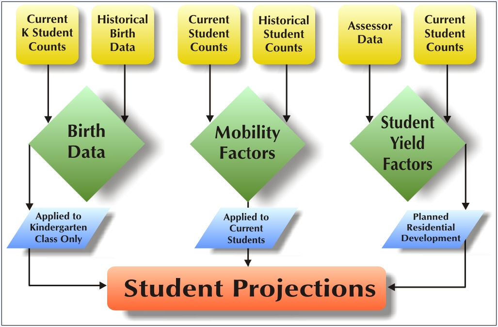

# Maturation Methodology
The maturation forecast process combines current housing (obtained from the local County Tax Assessor files), projected development (city or developers) and an estimate of additional potential housing (from aerial photos, area zoning maps and discussions with city or county planning officials) for the District. The sum of housing counts by type and by study area determines the total number of units in the district at maturation. This housing count totaled by type and by study area is multiplied by the appropriate maturation student yield factors to produce the maturation forecasts.

## Current Housing Units
The total number of current housing units is determined using the district's local county tax assessor data. This data should be a geocoded point layer of existing housing within the district. The housing type or use code is generally available within the county assessor records. You may need to add an additional field onto the assessor table to generalize the various use codes down to a maximum of four housing types to which you want to apply maturation student yield factors. Typically, DDP uses four housing types: SFD (Single Family Detached), MFA (Multi-Family Attached such as condominiums or townhomes), APT (apartment or rental units) and MBL (for mobile homes). However, the district can use whatever categories you wish so long as it matches the same four housing types defined for, and are being used for, new housing development (i.e. your tract dataset). (For example, your tract dataset and your assessor dataset must use the same housing category definitions. In other words, you cannot have Type 1 defined as SFD in your tract dataset and Type 1 defined as APT in your assessor dataset.) 

When creating a maturation forecast in the Create New Projection Wizard, specifying your optional assessor point dataset will fill in Year0 in your forecasted housing units table, indicating the number of current housing units by type in each study area.

## Planned Development
Planned development refers to known and approved future residential development. This information is stored in the same tract dataset used in the ten year forecast model and includes information on the number of units and phasing completion schedules. This is an optional data set only for those districts with active residential construction. An optional tract dataset, when specified during the Create New Projection Wizard, will fill in the number of housing units anticipated by study area and by type for years 1 through 10. Any phasing of units in the tract dataset that extends beyond the next ten years will fall into Year11 which accounts for potential development.

## Potential Development
Potential development refers to the number of residential housing units in each study area that could be built and have not already been accounted for as existing (from the assessor file) or those not accounted for as subdivision maps (from the tract dataset). Additional potential units that could occur on vacant property is entered by the user into Year11 within the forecasted housing units dialog window. The number of units entered is determined by the user based upon a best estimate of additional units that could be built in each study area using information from aerial photos, zoning maps, and potential land use plans.

Acreage of vacant property can be estimated in a study area by drawing polygons within ArcMap indicating vacant property having ArcMap ascertain the estimated acreage. That acreage could be multiplied by the density factors (allowed units per acre) determined from zoning or land use maps. For example, an area of vacant land identified as 80 acres, multiplied by a zoning density of 5 dwelling units per acre should generate 400 future housing units.

## Maturation Student Yield Factors
As in the ten year forecast which may use new residential development, student yield factors are multiplied by housing units to generate a certain number of students. For maturation forecasts, the total number of housing units from current, planned, and potential development are multiplied by Student Yield Factors to estimate the number of students in each study area. Student Yield Factors for maturation are generally different than those used in the ten year new housing forecasts. The student yield factors used in the ten year forecasts are generally based on a sampling of housing units less than five years of age to better represent the number of students that would be generated as new homes are completed. Whereas, maturation, representing a future point in time with all ages of housing units, uses student yield factors that are based upon a large sample of units within the district both old and new. Generally, maturation student yield factors will have lower K-6 numbers and higher 9-12 numbers than a ten year forecast student yield due to the fact that as homes age students will be distributed more evenly among the grade levels. For this reason, ten year forecast student yield factors are not generally used for maturation since they would potentially over-estimate elementary students and under-estimate high school students for long range planning.
