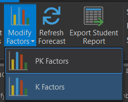

# Kindergarten and Pre-Kindergarten Birth Factors

The first set of variables used to modify a straight pass-through projection is birth factors.
Birth factors play a important role in the projection model as it determines the number of incoming Kindergarten students.

Most kindergarten students are 5 years old when they enter school.  Knowing when the current kindergarten class was born, you can estimate the class size of incoming students. 
In using the example below, projections are for the current 2002 school year, therefore, we can assume the Kindergarten class was born in 2005.  
The year the current Kindergarten class was born is called the base year. To assist in calculating the following year's Kindergarten class (2011), you would compare the number 
of births from 2005 (2010 K) and compare them with the number of births in 2006 (2011 K).  This increase or decrease percentage is applied to our current Kindergarten class to 
help project an increase or decrease in next year's Kindergarten class. Similarly to estimate the  2012 Kindergarten class, compare the births between 2007 with the base year 2005. 
For 2014 and beyond, the birth factors must be estimated based on past trends because those children have not yet been born. 
Since, in this example, the birth factors are on the decline, a birth factor of 93% was used.  

## Calculating Birth Factors

The first step in calculating birth factors is to obtain the number of births that occurred within the district for most recent five years. 
In most cases, you can obtain the number of births, collated by zip codes, from your State's Department of Health and Statistics.  
In this example, the district contains three zip codes - 92625, 92626, and 92627.  After the number of births, by year, by zip code are obtained and totaled, the percentage of 
change from the base year (2005) is calculated by dividing future years (2006-2009) by the base year (2005).  Because data for 2009 and beyond would not yet be available,
birth factors would be estimated based on past trends.  Here, we estimated a continued decline in births at 93% of the base year.

## Entering Birth Factors 

1. Click on the drop down menu for Modify Factors in the Forecasting ribbon.

2. Choose either K or PK Factors

3. Choose a method to display the study areas:

The first is to display study areas that are “Currently selected on the map”.  If you have selected study areas from the map display, this option will be available. If chosen, only the selected study areas will display for modification.  If you have no study areas selected, this option will not be available.

The second option is “Select by attendance area”.  With this option, choose the school attendance area from the dropdown list for which you wish to assign birth factors. This will display only the study areas that are currently assigned to that school attendance area. You can then modify birth factors for just those study areas.  Use this option when a specific area of the district is known to experience significantly higher or lower birth factors than surrounding areas.

The third (and most common) option is “Select all” which displays all study areas.  It is important to understand that when you make changes to the variables with the Select All option, that changes will affect all study areas in the district.

The Birth Rates are stored in the table on the right hand side of the form.  Once the study areas to display option is selected, you can modify each individual cell, changing the factor for each year and each study area.  

Or you can click on the top of the column of the year you wish to change and enter the number in the calculate field on the bottom of the form and it will change the birth factor for that year for all study areas selected/displayed.
