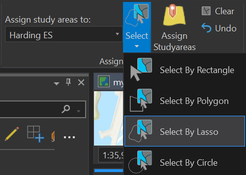
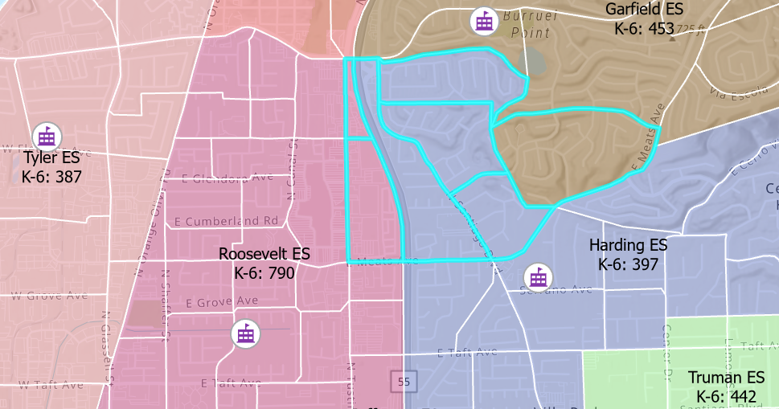
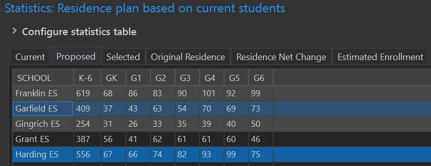
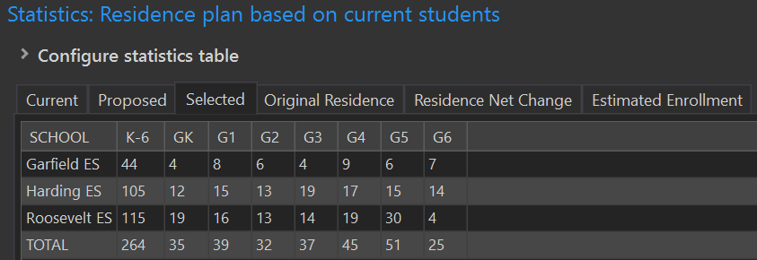

# A tour of the redistricting ribbon
The following is a brief tour of the basics of Redistricting in SchoolSite Pro. 
[test](https://ssphelp.mgt.us/images/Assign.png)

## Choose Schools and Grades to View
Before attempting to redistrict, it is helpful to view the current resident student population by grade for each school. The SchoolSite Redistricting Extension allows for viewing statistics via the Statistics Window.  The Statistics Window presents the data in a tabular format and can either remain floating or be docked like the Contents Pane. To access this feature, click on the Show Statistics in the Assign ribbon.

1. From the Redistricting Toolbar, choose Show Statistics in the Assign ribbon. 

2. To create a report for all schools in the District, click on the blue Select All hyperlink under the section "Schools"

3. Be sure the Grade Distribution button is selected under the section "Statistics Type"

4. For this example, check mark the grade range K-6 in the Grade Ranges box. The grades included in the ranges will automatically be checked. To display only grades K and 6, click Select None in the top right corner, then check grades K and 6 in the Grades section and the table should automatically update.

The Current Statistics Widnow shows current statistics based on boundaries shown.  If you want to modify these boundaries, start by reassigning study areas.  Study Areas are geographically defined, following logical boundaries of a neighborhood and are used for gathering data. In SchoolSite, attendance area changes are simulated by assigning study areas to different school attendance areas. See topic ["Changing Boundaries Between Schools"](redistricting/modifyPlans/changeBoundaries.md) for more information.

## Turn on Labels
1. Contents Pane > Right click on Boundary Plan > Label 

2. Your map now displays the names of your school attendance areas!

## Modifying Boundaries
To simulate boundary changes between attendance areas, begin an assigning session from within the Assign ribbon.

1. From the Redistricting Plan select the Assign ribbon > Start Assignment 

2.  To reassign study areas from existing schools select, from the Assign ribbon and Assign Tools group, the drop-down arrow below "Assign study areas to:" and select the school you wish to assign study area(s). In this case, select Harding ES.

3. Next, in the Select drop down menu choose Select by Lasso.
 

 
4. Click and draw a loop within the study areas to be reassigned to Harding ES. The plan should appear similar to the screenshot below. 

**Please note:** Selecting study areas that are already assigned to Harding ES will not change after reassigning them to Harding ES. 

5. The selected study areas are highlighted in bright blue.  

6. To see how the reassignment of the selected study areas would affect that school, open the Statistics Table and click on the Proposed Tab.  

7. To view only the statistics for the selected study areas, click on the Selected Tab.

## Commit the Modification
1. If the changes are acceptable, commit the change. In the Assign Tools group, click on Assign Studyareas. The statistics window and map will update.  You can roll back your changes prior to permanently saving them by clicking on the Undo button in the Assign Tools group.

2. If you are certain you want to make your changes permanent, click on Save Assignments in the Assign group.

3. When finished, stop the edit session by clicking Stop from the Assign group. **Please note: Once you choose to Save Assignments or Stop Assigning, you can no longer undo edits.** 

4. If necessary click on Show Statistics, the Current Residence Tab reflects the update.

5. To review the original statistics when the plan was first created, click on the Original Residence tab.
