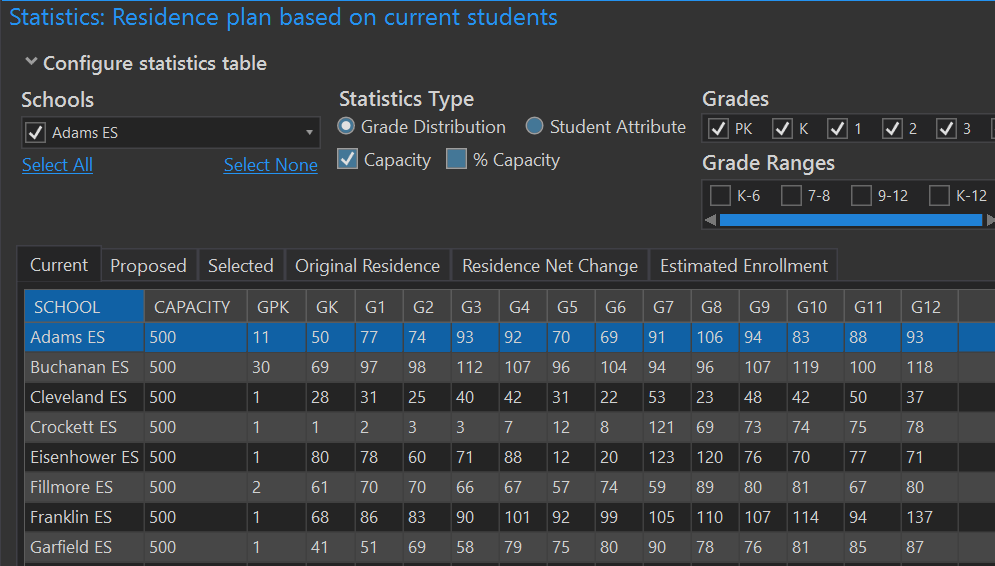
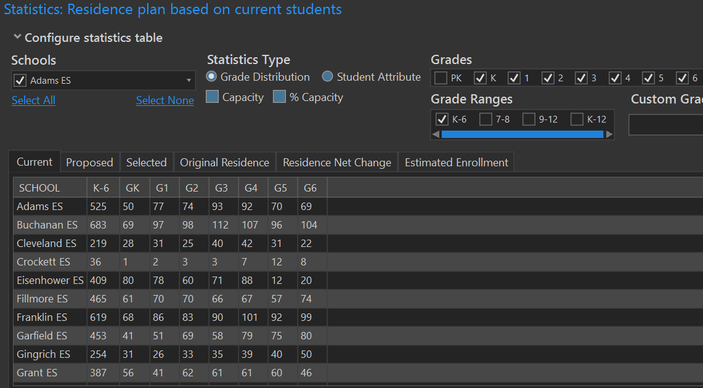
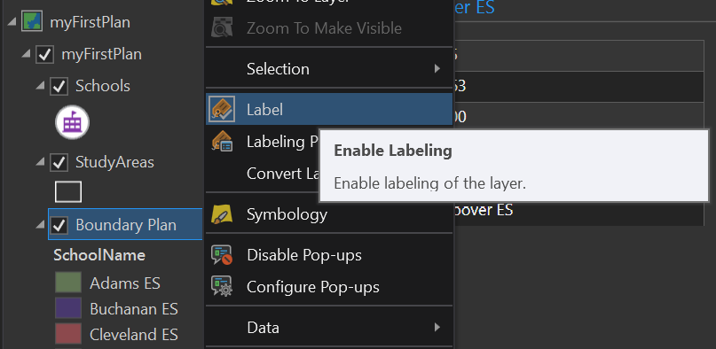
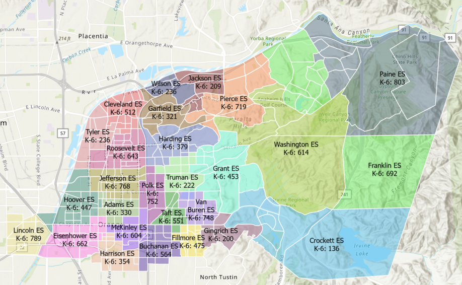
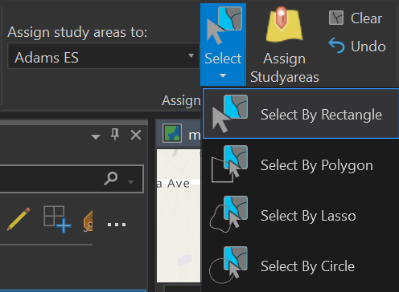
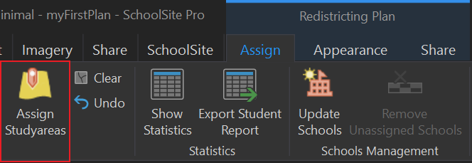

# Brief Tour of the Redistricting Toolbar
The following is a brief tour of the basics of SchoolSite Redistricting Extension using the sample data which is copied onto your hard drive during software installation. The sample data is installed under the following folder by default:

 

C:\Davis Demographics\GIS_SampleData
## Open the Existing Sample Plan
To open an exisitng plan , Catalog Pane > Maps > Sample Plan

## Choose Statistics
Before attempting to redistrict, it is helpful to view the current resident student population by grade for each school.

## Choose Which Schools and Grades to View
1. From the Redistricting Toolbar, choose the Plan Properties button . The Statistics Tab should display.

2. To create a report for all schools in the District, click on the blue link Select All under the section "Select Schools"

3. Be sure Grade Distribution radio button is selected under the section "Select statistics type"

4. For this example, check mark the grade range K-6 in the Select grade ranges section. The grades included in the ranges will automatically be checked. To display only grades K and 6, click Select None, then check mark only grades K and 6.

5. Click OK.

6. The SchoolSite Redistricting Extension allows for viewing statistics via the Statistics Window.  The Statistics Window presents the data in a tabular format and can either remain floating or be docked like the Redistricting toolbar. To access this feature, click on the Statistics button  on the Redistricting Toolbar or choose the Redistricting button and click on Statistics Window.

The Current Statistics Tab shows current statistics based on boundaries shown.  If you want to modify these boundaries, start by reassigning study areas.  Study Areas are geographically defined, following logical boundaries of a neighborhood and are used for gathering data. In SchoolSite, attendance area changes are simulated by assigning study areas to different school attendance areas.  In this example, you can  now try to simulate a boundary change and reduce the number of students living within the North Elementary Attendance Area. (See topic "What Are Study Areas?" for more information.)

## Turn on Labels
Through SchoolSite's Plan Properties, you can turn on different labels that adjust dynamically to your plan.

 

1. Open up Plan Properties again by clicking the Plan Properties button  in the Redistricting Toolbar. The Plan Properties window should open.

2. At the top of Plan Properties, click on the tab labeled Symbology. Here, you can change the style of how your map looks.

3. There is a section labeled Labeling. Check mark the first option that says, "Display attendance area names." Then click OK.

4. Your map now displays the names of your school attendance areas!

Modifying Boundaries
To simulate boundary changes between attendance areas, begin an assigning session from within the SchoolSite Extension.  

 

1. From the SchoolSite Redistricting Toolbar > Assign > Start 
2.  To reassign study areas from existing schools, from the Redistricting toolbar, click on the drop-down arrow next to the School field and select the school you wish to assign study area(s). In this case, select Adams ES.
3. Next, choose the Select by Polygon feature tool from the Redistricting Toolbar.
 
 
 
4. Click and draw a loop within the study areas to be reassigned to Adams ES. The plan should appear similar to the screenshot below. Please note: Selecting study areas that are already assigned to Harding ES will not change after reassigning them to Adam ES.  
5. The selected study areas are highlighted in bright blue.  To zoom in closer, click on the Zoom to Selected Features button  on the Redistricting Toolbar.
6. To see how the reassignment of the selected study areas would affect that school, click on the Proposed Statistics Tab.  The school name highlighted in blue indicates the school in which student population increased.  The school name in red designates which school(s) experienced a decrease in student population. Notice the chart reflects the changes in student resident population as well.

7. To view only the statistics for the selected study areas, click on the Selected Residence Tab.

## Commit the Modification
1. If the changes are acceptable, commit the change. In the assign ribbon, click on Assign Study Areas. The statistics window and map will update.  You can roll back your changes prior to permanently saving them by clicking on the Undo button in the assign ribbon.

2. If you are certain you want to make your changes permanent, click on Save Assignments in the Assign the ribbon.
3. When finished, stop the edit session by clicking Stop from the Assign. **Please note: Once you choose to Save Assignments or Stop Assigning, you can no longer undo edits.**  
4. If necessary click on Show Statistics, the Current Residence Tab reflects the update.
5. To review the original statistics when the plan was first created, click on the Original Residence Tab.
 
