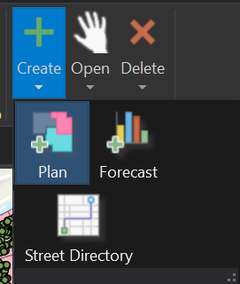
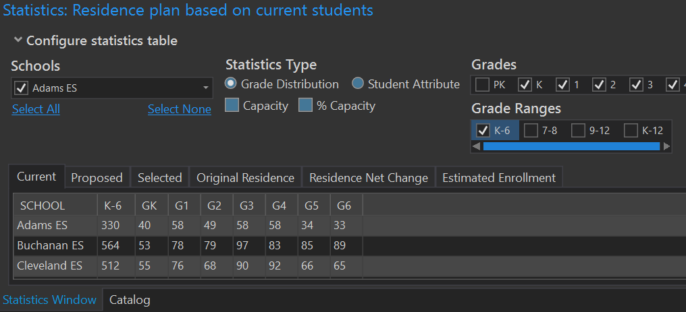
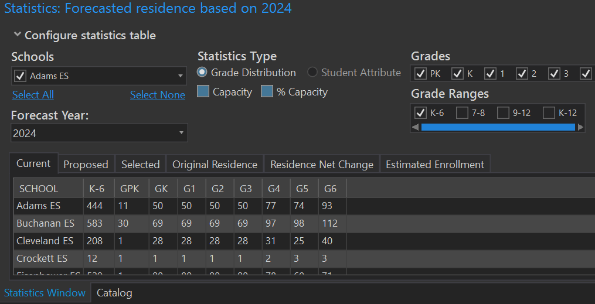

# Create a new redistricting plan
To begin a new redistricting plan, on the SchoolSite ribbon, click Create, then Plan. 

The Create dockpane will display. 

## Types of redistricting plans 
Three types of plans can be created in SchoolSite Pro:

### Type 1: Create a plan based on the current residence
A redistricting plan based on current resident students displays the number of students residing within each attendance area whether or not they are enrolled in the area's assigned school.  As attendance areas are modified, all students residing in the selected areas are moved to the newly assigned school of attendance.  This selection is most useful for facility planning and for understanding the true impact of student population distribution in relation to school locations.

### Type 2: Create a plan based on enrollment 
A plan based on resident and enrolled students displays statistics for both the current resident student population of each attendance area (same as the Current Resident Student plan) as well as the estimated enrollment totals at each school.  Changes in enrollment totals as attendance areas are modified are determined by a pre-defined set of rules based on each student’s program, grade, and current school of enrollment. 

### Type 3: Create a plan based on forecasts
A redistricting plan based on projected resident students displays the current and forecasted resident student population of each attendance area.  The statistics presented in this plan illustrate the true growth and decline of the student population within areas of the District and are useful for school opening and closure analysis as well as defining attendance areas that match forecasted resident population with school site capacities around the District. This is the proper method for long-term facility and attendance area planning

# Copy a redistricting plan
You can also create new Plans by copying an existing redistricting Plan. This is useful if you want to make some initial basic changes to the boundaries that will apply to all scenarios, and then create variations on top of those changes. 

Copying a Plan is just like copying a map in ArcGIS Pro. From the Catalog pane, open the Maps section and find the map that contains your Plan. 

If you are unsure which maps have Plans, click the Open button from the SchoolSite ribbon to get a specific list of SchoolSite Plans and Forecasts. 

Right-click the map that contains the Plan that you would like to copy and choose Copy. Then, right-click on the Maps folder and click Paste'.

A copy of your Plan will appear with the same name and the number '1' at the end.

At this time, you can now rename your Plan by simply renaming the map as you would any other map in ArcGIS Pro. 

SchoolSite Pro will understand that this map contains a plan and will update tables accordingly to update the Plan's name.

