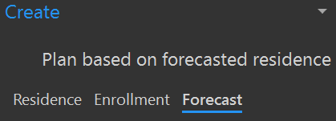
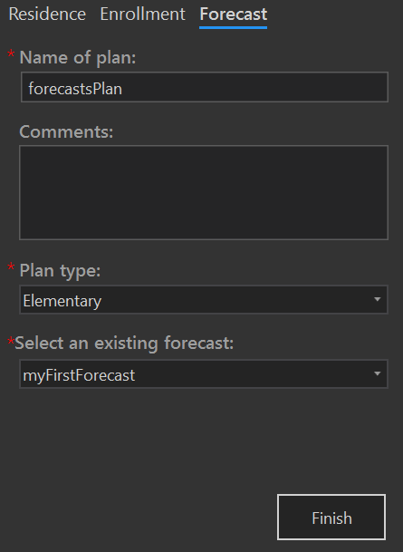

# Redistrict based on a forecast
**Please Note:** You must first create a forecast before creating a redistricting plan based on a forecast.

To create a new redistricting plan based on a forecast, on the SchoolSite ribbon, click Create, then Plan. A Create dockpane will display. Make sure the Forecast tab is selected.

Type in the name of your plan and select the type of Plan you wish to create by selecting your District's Elementary, Middle, Intermediate or High School boundaries. You will then select an existing forecast.

Click the Finish button when done. The plan will take a few minutes to create. Plan creation for larger school districts take additional time based upon the number of study areas, number of students, number of fields on the student attribute table and the processing power of your computer.
