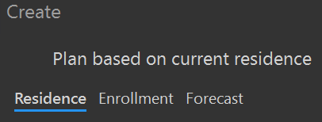
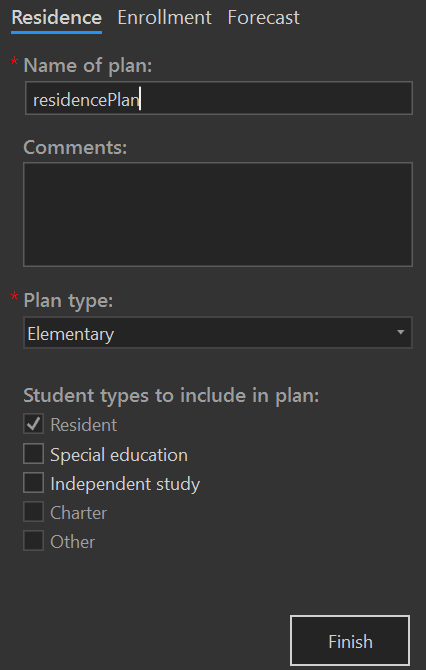

# Redistrict based on current resident students
To create a new redistricting plan based on current resident students, on the SchoolSite ribbon, click Create, then Plan. A Create dockpane will display. Make sure the Residence tab is selected.

Type in the name of your plan and select the type of Plan you wish to create by selecting your District's Elementary, Middle, Intermediate or High School boundaries. You can also choose to include additional student types in your plan.

Click the Finish button when done. The plan will take a few minutes to create. Plan creation for larger school districts take additional time based upon the number of study areas, number of students, number of fields on the student attribute table and the processing power of your computer.
