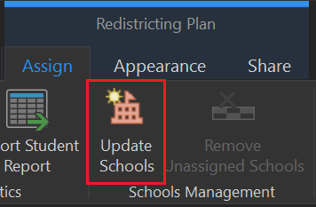
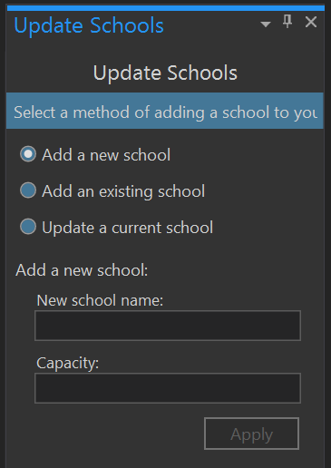

# Adding a New School
From the SchoolSite Redistricting Extension Toolbar, choose the assign tab, then Update Schools. You can only add new schools when your active plan is not in editing/assigning mode. If you are in assignment mode, the add new school menu option will be grayed out.

Type in the name of the new school and its capacity, and click OK.

The name of the new school will appear in the school field of the Redistricting Toolbar.  Once you begin assigning study areas to that school, the new school's name will be listed in the chart and proposed statistics windows.

 
**Please Note:**  A school point will not be added to your school layer since the program has no way of knowing where you might want to have the new school located. It assumes the school would be located somewhere within the attendance area you are designing. You can place a school point graphic in the general area you feel the school will be located by using the ArcGIS graphic point symbol shown below.  The point symbol can be found on the ArcGIS Drawing Toolbar.
