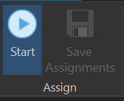

# Change boundaries between schools
You might need to make redistricting changes after reassigning study areas or if your district has to make changes to existing boundaries. You can make these changes to balance student population by residence and site capacities.

To reassign study areas to existing schools, you must have at least one plan open in the SchoolSite Pro table of contents and have the plan you wish to edit as the active plan.

### 1. Begin the editing session: Choose the assign tab under Redistricting Plan. Then choose Start in the Assign ribbon.  

**Use Caution when Assigning:**
When assigning study areas, please refrain from using any other editing tools and only use the Undo button provided in this ribbon. Otherwise, you could expereince unexpected results when moving study areas between attendance boundaries. Once you click "Stop Assigning" you can then use all the editing tools and the normal undo button without affecting your plan.

### 2. To reassign study areas from existing schools, from the assign ribbon, click on the drop-down arrow under "Assign study areas to:" and select the school to which you wish to assign the study area(s).

### 3. Turn on Labels to view boundary names. 

Contents Pane > Right click on Boundary Plan > Label

### 4. Once a school has been chosen, choose a select feature tool from the toolbar. Listed in order, the available selection tools are:

* Select Features

* Select by Rectangle 

* Select by Polygon

* Select by Lasso

* Select by Circle

## Modifying Boundaries

### 5. After choosing a select tool, click on the study areas to be reassigned to the study area you chose to assign to. The selected study areas are highlighted in bright blue.
### 6. To see how the reassignment of the selected study areas would affect that school, click on the Proposed Statistics Tab.

### 7. To view only the statistics for the selected study areas, click on the Selected Residence Tab.

**See topic ["Statistics Window"](../statistics/statsWindow.md) for more information.**

## Commit the Modification
**IMPORTANT: If the changes are acceptable, commit the change.  In the assign ribbon, click on Assign Study Areas. If you are certain you want to keep the changes permanently, choose Save Assignments from the assign ribbon. Once you choose to Save Assignments or Stop Assigning, you can no longer undo edits.**

 
 
### 8. To undo an assignment, click on the Undo button on the assign ribbon before Saving Assignments. When finished, stop the edit session by choosing Stop from the assign ribbon.
