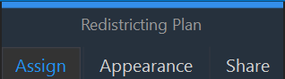

# Changing Boundaries Between Schools
To reassign study areas to existing schools, you must have at least one plan open in the SchoolSite Pro table of contents and have the plan you wish to edit as the active plan.
Begin the editing session: Choose the assign tab under Redistricting Plan. Then choose Start in the Assign ribbon.  

## Use Caution when Assigning
When assigning study areas, lease refrain from using any other esiting tools and only use the Undo buttion provided in this ribbon. Otherwise, you could expereince unexpected results when moving study areas between attendance boundaries. Once you click 'Stop Assigning you can then use all the editing tools and the normal undo button without affecting your plan.

To reassign study areas from existing schools, from the assign ribbon, click on the drop-down arrow under "Assign study areas to:" and select the school to which you wish to assign the study area(s).

Once a school has been chosen, choose a select feature tool from the toolbar. Listed in order, the available selection tools are:
* Select Features

* Select by Line  

* Select by Polygon

* Select by Circle

1. Select Features – With this method you can click in an individual study area to assign it to the selected school. You can select multiple study areas by holding down the shift key as you click.

2. Select by Line – Using this feature, click in the study area you wish to assign and drag the mouse in any direction.  Double click the left mouse button to finish the line. All study areas that the line overlaps will be selected and assigned to the selected school.

3. Select by Polygon – Begin drawing the polygon by clicking once and dragging the mouse and clicking again to form a side of the polygon.  Continue clicking to create the desired polygon and close the polygon by double clicking.  All study areas that the polygon overlaps will be selected and assigned to the selected school.

4. Select by Circle – The circle will expand from the center of where you initially click.  Hold the left mouse button down when you click and drag the circle outward to the desired diameter.  Then double click to finish the circle.  All study areas that the circle overlaps will be selected and assigned to the selected school.

 IMPORTANT: If the changes are acceptable, commit the change.  Right click anywhere in the map display and choose Assign Selected. If you are certain you want to keep the changes permanently, choose Save Assignments from the assign ribbom.

 

 To undo an assignment, click on the Undo button on the assign ribbon before Saving Assignments.

 

When finished, stop the edit session by choosing Stop from the assign ribbon.

 
