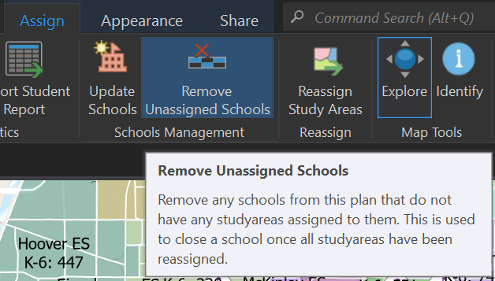

#  Closing Schools

In order to simulate the closing of a school, the assigned study areas must first be reassigned to other schools.  Use the selection tools to assign study areas to neighboring schools (You can view the statistics window to note the changes as you adjust the boundaries).  Once you have reassigned all study areas away from the school you wish to close, save your assignments.

 From the SchoolSite Redistricting toolbar, choose the assign tab, then remove unassigned school(s). Removing unassigned schools will delete the school point location on the map and remove the school reference in the plan in the table of contents.  
 
 

 
To reassign study areas read the [Changing Boundaries Between Schools](changeBoundaires.md) topic.

