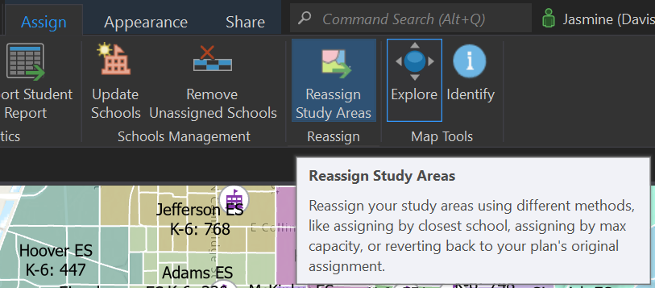
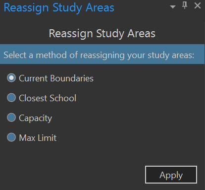
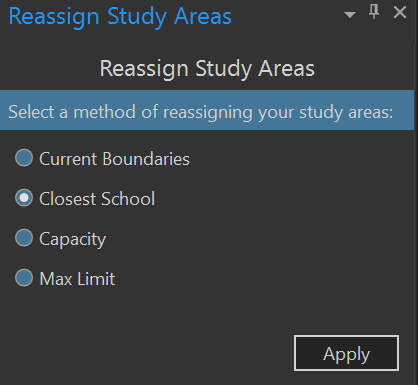
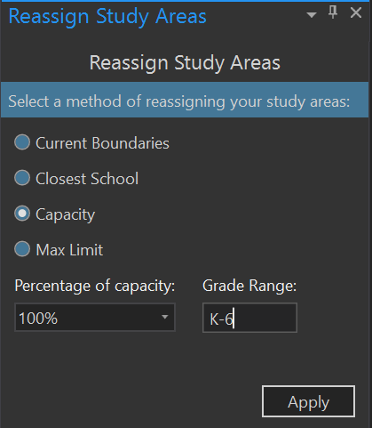
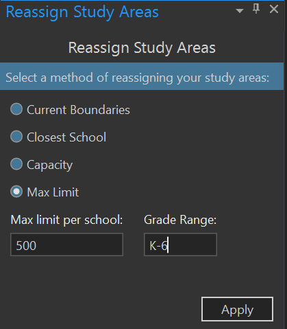

# Reassign schools
From the SchoolSite Redistricting Extension Toolbar, choose the assign tab, then Reassign Study Areas.

 
There are multiple ways to reassign schools to different study areas. Reassign Schools helps you choose the best method for your district.

1. **By current boundaries** – Choose this method if you want to go back to the current boundaries that the study areas are assigned.

 
2. **By closest school** – Choosing this method will assign the study areas to the closet school and create all new attendance areas.

 
3. **By school capacity** - If the capacity field is filled in for each school in the school layer, a plan can be reassigned based on these limits.  Similar to the maximum student assignment option described above, the study areas that exceed the limit per school will be shaded in grey. Be sure to set the grade range appropriate to the type of plan being created (i.e. High school plan will most likely have a specified grade range of 9-12).

 
4. **By maximum students** - Choose this method if you want to specific the maximum number of students by grade range by entering the maximum number of students allowed at the grade range specified. The study areas that exceed the maximum limit will be shaded in grey.  This will show where a new school might be needed.

