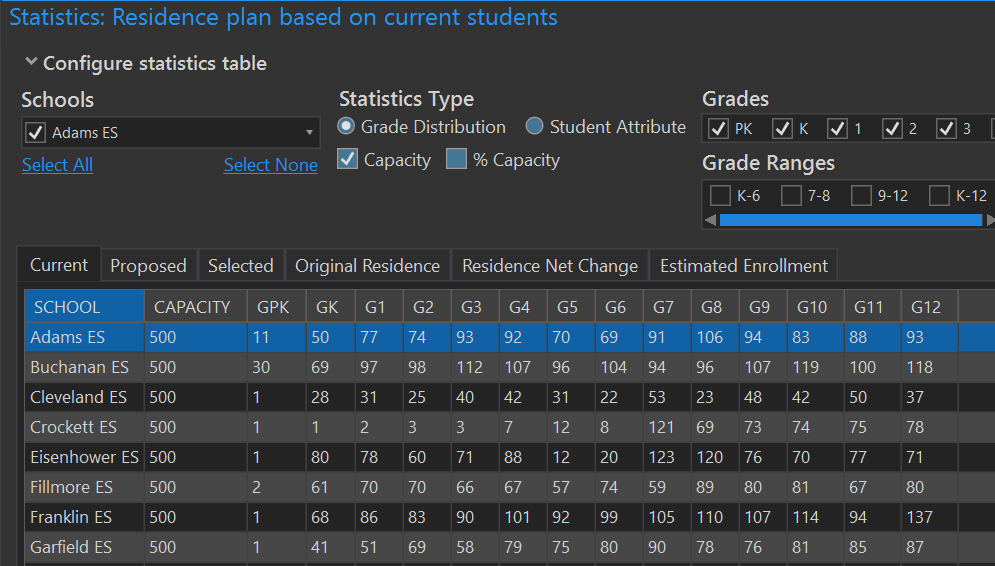

# Statistics Window
## The Statistics Window: Current Residence
The Current Residence Tab allows you to preview the statistics before making changes to a plan.  The first tab, current residence, shows the number of students by residence before you assign any selected study areas.  Once you assign the selected study areas however, the current residence window updates to reflect the adjustment.  The school name highlighted in blue is the school to which the last study areas were assigned.

## The Statistics Window: Proposed Residence
The Proposed Residence Tab displays the changes in resident enrollment based on changes in selected study area assignments.  They represent what the changes would be to the plan before you actually commit the changes. After you assign the changes, the current residence will update to reflect what was in the proposed residence. The school name highlighted in blue indicates the school to which students were added.  The school name(s) in red designate which school(s) had a student decrease.

## The Statistics Window: Selected
The Assigned Residence Tab shows the number of students living in the study areas currently selected and waiting to be reassigned. It indicates the number of students in all selected study areas. The difference between current resident school numbers and proposed resident school numbers is the number of students in the Assigned Residence tab.

## The Statistics Window: Original Residence
The Original Residence tab displays the statistics before any changes were made. The student numbers in this tab remain static regardless of any assignments made to the plan. It represents the original baseline number of student when the plan was first created.

 
## The Statistics Window: Residence Net Change
### For Redistricting by Current Students
The Net Change tab calculates the total difference between the Original Residence and the Current Residence tab.  The total change will always equal zero as some schools gain students and some schools lose students.

### For Redistricting by Projected Students
The net change is a combination of projected enrollment changes from the base year of the projection to the year you are currently showing, as well as any boundary changes that will add students are remove students from a given school. In this case the net change will not equal zero it will reflected the total increase or decrease from the base year to the year being displayed.

## The Statistics Window: Estimated Enrollment
**Please Note:** This tab will only be populated for plans based on current students and current enrollment

 

The Estimated Enrollment Tab displays theoretical school enrollment totals as study areas are reassigned. Students are recalculated based upon the grade range specified in the create plan wizard as well as based upon the predefined rules that govern reassignments for plans based on current resident students and current enrollment.

 
